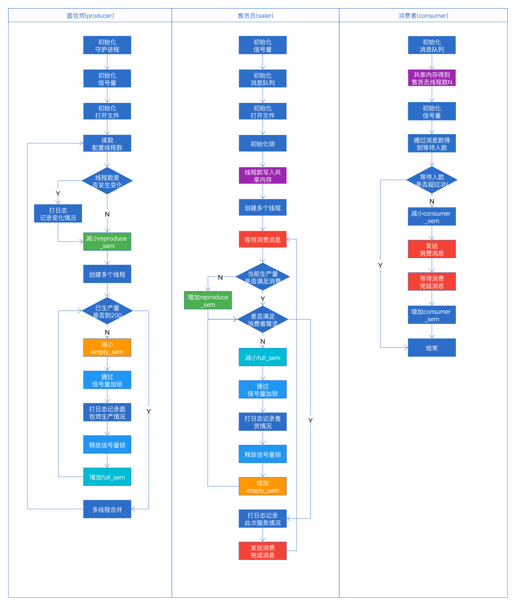
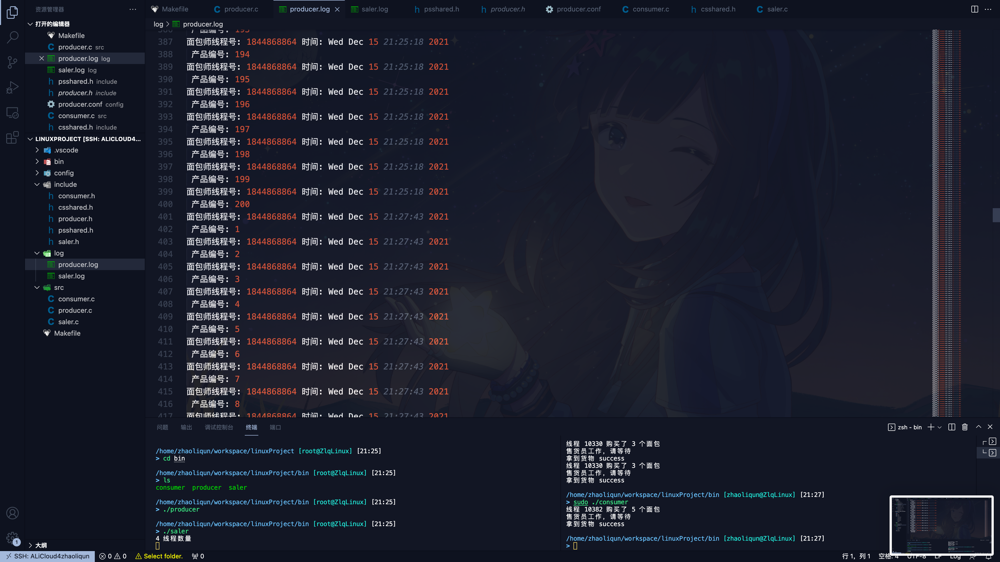

## Linux Project

Linux与C课程作业

### 构建与运行

```shell
make
cd bin
./producer
./saler
./consumer
```

### Project要求
用C或者C++实现一个面包师，售货员与消费者的程序。即存在一个面包房，里面有面包师，售货员。面包师负责生产面包，售货员负责售卖面包，消费者通过售货员购买面包。
要求：
1.面包师程序为多线程程序，将该程序编写成系统的daemon程序，要求系统在启动时自动运行，启动的输出信息写到linux的rsyslogd的日志文件中。该程序的线程数量可以动态变更，线程变更情况也要记录在rsyslogd的文件中，面包师线程数量不小于1，不大于10（例如原配置文件中规定线程数为3，修改配置文件后变成5，该程序能够在不重启的情况下，线程数变成5.）
2.面包师程序的生产线程要实现当面包房剩余的面包数量小于2时或者销售员程序要求面包师程序生产新的面包时自动开始生产面包，当未被销售的面包数量等于200时自动暂停生产。面包师程序每生产一个产品就在记录一次（生产者线程号，时间，产品编号），记录信息存放到单独的文件中，不需要rsyslogd记录。
3.售货员程序也为多线程程序，每一个线程表示一个售后员。售货员数量在程序启动时随机产生（2-10），当没有消费者时，售货员处于等待状态，当消费者到达时唤醒售货员，售货员在卖出面包时记录相应的信息（售货员线程号，售货时间，本次卖出的面包数量），售货员线程发现没有办法满足消费者购买的面包数量时，通知面包师生产面包。
4.消费者程序为单线程程序，系统允许最多不超过n（售货员数量）个消费者程序同时消费，如果第n+1个消费者程序启动后发现没有空闲售货员，就输出相应的信息后退出或者排队等待(排队等待的消费者数量不大于3n）。每个消费者程序每次最少取走1个产品最多可以取走5个产品，取出产品后输出退出。
5.所有的程序在同一台机器上运行。

### 程序介绍

项目流程图（彩色部分为IPC相关）如下



此项目中生产者与售货员之间通过信号量传递面包生产情况，售货员和消费者之间通过消息队列的形式传递消费请求，并且售货员会将线程数写入共享内存当中，消费者消费时可以通过共享内存拿到这个值，用来初始化等待人数上限（3倍的线程数），消费者每次消费时，会先检测消息队列的消息数，这个数值可以等同于等待者人数，如果这个数大于上限，则直接退出，否则进入等待，通过信号量来控制相同时间内最多服务的线程数。

在/etc/rc.d/init.d下添加脚本将生产者服务作为开机自启动项，注册producer服务。

### 截图记录

下图是实际运行时截图。

生产者开始生产，到200停止生产。


消费者开始消费，saler.log记录下了售卖情况。


当消费者将200个面包消费完之后，生产者重新开始生产。



同样也是生产到200个之后停止生产。


### 总结

目前代码实现了需要的基本功能，但是存在一些情况，比如发送SIGHUP信号给售货员之后，下次再运行信号通道还是保持之前的，可以从两方面进行优化。
1、每次信号量取随机生成字符串，避免了繁琐的手动修改。
2、给售货员程序加上一个终止输入，如：q，在命令行输入q之后，售货员就主动进行sem_close，关闭使用的信号量。
通过这门课对于Linux系统和在Linux系统上的系统编程有了了解，并且通过实践增加了自己的编程经验，一个并不复杂的多线程程序，真正写起来还是很需要思考的，代码量也不小。这或许就是为什么C++不用于普通业务开发，大家更倾向选择更加简单的Java和Go。但是我认为作为一名程序员，了解C和C++还是十分有必要的，毕竟我们真正的系统接口都是C写出来的，如果要了解Linux系统的话，C语言是不可或缺的能力。